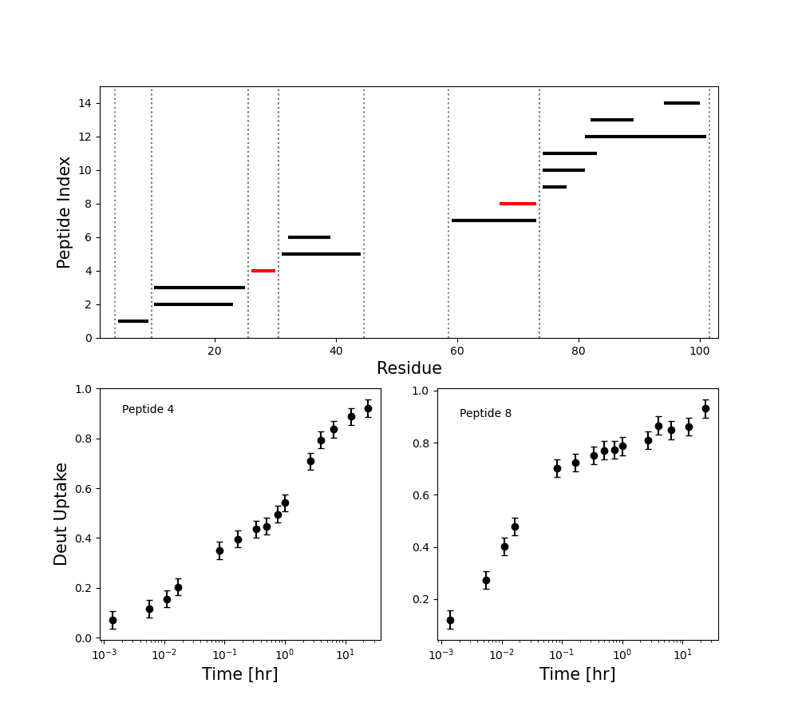

# Experimental validation

This folder contains the necessary information to reproduce the results published in *paperlink*, 
showing a correlation between protection factors extracted by ExPfact and more accurate NMR measurements. 

## Dataset

The dataset was previosly published by [Moulick et al. (2015)](https://www.ncbi.nlm.nih.gov/pmc/articles/PMC4646174/) 
and probed the mouse prion protein (PDB 1AG2, sequence in `moprp.seq`) with MS and NMR under the same conditions, 
i.e. pH 4 and temperature 25°C. 
In the HDX-MS experiment, the quench buffer was characterized by pH 2.4 and temperature 0°C.

The protein was digested by pepsin, and 14 peptides were identified with a 73% coverage (file `moprp.list` and `moprp.ass`). 
The exchange was monitored at 15 exchange times ranging from 5 seconds to 24 hours (file `moprp.times`).
The deuterium uptake curves for each peptide were normalized (0<=D<=1) using a fully deuterated sample. 
The peptide map and the uptake of peptides 4 and 8 is shown below:



A subset of 27 amino acids was covered by both MS and NMR techniques. 

## Test minimization

To run a single minimization:

``` python ../python/exPfact.py --temp 298 --pH 4 --dexp moprp.dexp --ass moprp.list --rand 10000 --seq moprp.seq --out test ```

## Cross-validation

## Multiple minimizations

## Clustering algorithm

## Isotopic envelopes

## Comparison with NMR data
